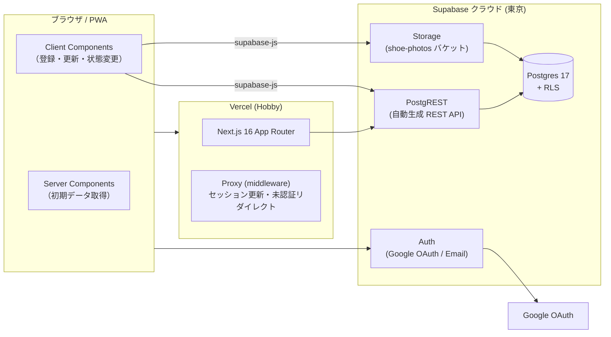

# 04. システムアーキテクチャ

> 本書は実装済みのシステムを説明するもの（実装が先行し、本書は後追いで作成）。
> 要件 ID は [01_requirements.md](01_requirements.md) を参照。

## 1. 全体構成

BaaS（Supabase）にサーバーサイドの責務を寄せた、いわゆる「バックエンドレス」構成。
自前の API サーバーは持たず、クライアントは Supabase の自動生成 API を直接呼ぶ。



## 2. 責務分担

| レイヤ | 担当 | 具体的な責務 |
|--------|------|--------------|
| Proxy（`src/proxy.ts`） | Next.js | セッション Cookie のリフレッシュ、未認証時の `/login` リダイレクト。**認可はしない**（楽観的チェックのみ） |
| Server Components | Next.js | 一覧・詳細の初期データ取得（Cookie のセッションで RLS が効いた状態の SELECT） |
| Client Components | ブラウザ | 書き込み系すべて（INSERT/UPDATE/DELETE/RPC/Storage アップロード）と楽観的 UI 更新 |
| RLS + トリガー | Postgres | **認可の唯一の本体**。Family 単位のデータ分離（NFR-S-1〜6） |
| RPC（SECURITY DEFINER 関数） | Postgres | RLS だけでは表現できない複合操作（Family 作成、招待コード発行・使用） |

設計原則: **「アプリ層が侵害されてもデータは漏れない」**。
Proxy や Server Component のチェックはすべて UX のためであり、セキュリティ境界は Postgres の RLS のみに置く。
この前提は `npm run test:rls`（[scripts/rls-test.mjs](../scripts/rls-test.mjs)）で自動検証している。

## 3. 認証フロー

### 3.1 Google サインイン（本番の唯一の手段）

```
1. /login で「Google でサインイン」
2. supabase-js が Supabase Auth の /authorize へリダイレクト（PKCE フロー）
3. Google 同意画面 → Supabase の /auth/v1/callback へ戻る
4. Supabase がアプリの /auth/callback へ認可コード付きでリダイレクト
5. Route Handler（src/app/auth/callback/route.ts）が exchangeCodeForSession を実行
6. セッション Cookie が発行され / へリダイレクト
7. 初回サインイン時は DB トリガー handle_new_user が profiles 行を自動作成（FR-A-4）
```

### 3.2 開発用パスワード認証

`NEXT_PUBLIC_ENABLE_PASSWORD_AUTH=true` のときだけ `/login` に UI が出る。
本番（Vercel Production）は `false`、ローカルと Preview は `true`。
メール確認は無効化しているため（`supabase/config.toml`）、開発用途以外では使わない。

### 3.3 セッション管理

- `@supabase/ssr` により、セッションは httpOnly Cookie で SSR と共有される
- Proxy は毎リクエストで `getClaims()`（ローカル JWT 検証。Auth サーバーへの往復なし）を実行し、
  期限切れが近いトークンのリフレッシュと Cookie の更新を行う

## 4. 画面と処理方式

| パス | レンダリング | データ取得 |
|------|--------------|-----------|
| `/login` | Client | なし |
| `/onboarding` | Client | RPC `create_family` / `join_family_by_code` |
| `/`（サイズ棚一覧） | Server（force-dynamic）+ Client | RSC で children/shoes を一括 SELECT → 子供切替・状態変更はクライアント（NFR-P-2） |
| `/shoes/new`, `/shoes/[id]/edit` | Server + Client | フォーム送信は supabase-js、写真は圧縮後 Storage へ直接アップロード |
| `/shoes/[id]` | Server | 詳細 + 写真の署名 URL 生成 |
| `/settings` | Server + Client | 招待コード発行（RPC）、サインアウト |
| `/auth/callback` | Route Handler | コード→セッション交換 |

## 5. デプロイ / 環境

| 環境 | ホスト | 認証手段 | Supabase |
|------|--------|----------|----------|
| ローカル開発 | `npm run dev`（localhost:3000） | Google + パスワード | クラウド共用（専用のローカル DB はなし） |
| Preview | Vercel（ブランチ push で自動） | Google + パスワード | クラウド共用 |
| Production | Vercel（main への push で自動） | Google のみ | クラウド共用 |

- GitHub `main` → Vercel Production の自動デプロイ（`vercel git connect` で接続済み）
- **全環境が単一の Supabase プロジェクト（無料枠・東京）を共有する。** 環境分離は
  無料枠 1 プロジェクトの制約による割り切り。利用者が家族のみなので許容している
- スキーマ変更は `supabase/migrations/` + `supabase db push`、
  認証設定は `supabase/config.toml` + `supabase config push` で反映（ダッシュボードでの手変更はしない）

## 6. 主要な設計判断の記録

| 判断 | 理由 |
|------|------|
| 自前 API サーバーを持たない | 家族数人規模に API 層は過剰。RLS を認可の本体とすることで実装量とバグ表面積を最小化 |
| ローカル Supabase（Docker）を使わない | 開発機のディスク・メモリ制約で断念（M0 当初計画から変更）。クラウド無料枠を直接使う |
| shoes.family_id の非正規化 | RLS ポリシーが children への join なしで書け、簡潔さと性能を両立（整合性はトリガーで強制） |
| 一覧は家族全体を一括取得 | 子供切替を 0 往復にするため（NFR-P-2）。データ量は家族規模では問題にならない |
| 認可チェックを Proxy でしない | セキュリティ境界を RLS に一本化。Proxy の役割はリダイレクトの UX のみ |
