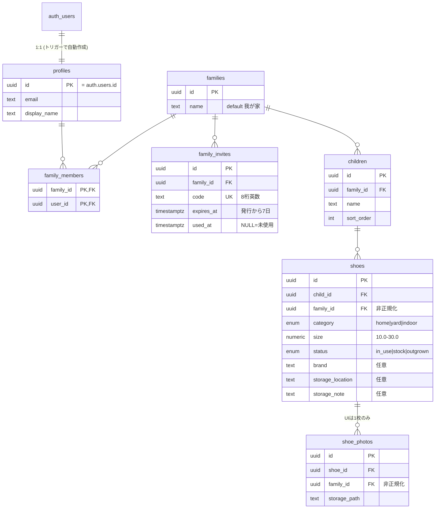

# 05. DB 設計

> スキーマの正は [supabase/migrations/](../supabase/migrations/) のマイグレーション。
> 本書は構造と設計意図の解説であり、DDL の詳細と食い違う場合はマイグレーションを正とする。

## 1. ER 図

## 2. 設計上のポイント

### 2.1 マルチテナントの単位は Family

- すべての業務データは `family_id` を持ち、RLS はこの列だけで判定する
- ユーザーと Family は多対多（`family_members`）。MVP の実運用は「1ユーザー1家族」だが、
  スキーマ上は複数所属を妨げない

### 2.2 `shoes.family_id` / `shoe_photos.family_id` の非正規化

RLS ポリシーを「親テーブルへの join なし」で書くための意図的な非正規化。

- **利点**: ポリシーが `is_family_member(family_id)` の一発で済む。行スキャン時の相関サブクエリが不要
- **整合性の担保**: クライアントの申告値は信用せず、BEFORE トリガー
  `enforce_shoe_family` / `enforce_photo_family` が親から正しい `family_id` を強制上書きする。
  他家庭の `child_id` を指定した偽装 INSERT は、上書き後の RLS `with check` で拒否される
  （`npm run test:rls` の「family_id 偽装込み」ケースで検証）

### 2.3 enum の採用

`shoe_category`（home / yard / indoor）と `shoe_status`（in_use / stock / outgrown）は Postgres enum。
値の集合は要件（FR-S-2, FR-S-9）で固定であり、追加時はマイグレーションで管理したいため
check 制約や自由テキストではなく enum とした。表示ラベルはアプリ側 `src/lib/domain.ts` が持つ。

### 2.4 サイズは numeric(3,1)

0.5cm 刻み（FR-S-1）を正確に扱うため浮動小数点ではなく numeric。
DB の check は 10.0〜30.0 と広めに取り、UI の選択肢（11.0〜25.0）はアプリ側で絞る。
一覧の「サイズ棚」グルーピングはこの値の昇順ソートで実現する（FR-L-1）。

## 3. RLS ポリシー一覧

認可の基本形はヘルパー関数 `is_family_member(family_id)`。
`SECURITY DEFINER` にすることで `family_members` 自身の RLS による無限再帰を回避している。

| テーブル | SELECT | INSERT | UPDATE | DELETE |
|----------|--------|--------|--------|--------|
| profiles | 本人 + 同 Family メンバー | ―（トリガーのみ） | 本人のみ | ―（cascade のみ） |
| families | メンバー | ―（RPC のみ） | メンバー | ― |
| family_members | 同 Family メンバー | ―（RPC のみ） | ― | 自分の行のみ（脱退） |
| family_invites | 発行 Family のメンバー | ―（RPC のみ） | ―（RPC のみ） | ― |
| children | メンバー | メンバー | メンバー | メンバー |
| shoes | メンバー | メンバー（+トリガー強制） | メンバー | メンバー |
| shoe_photos | メンバー | メンバー（+トリガー強制） | ― | メンバー |

「―」は該当操作のポリシーを定義していない＝一般ユーザーには常に拒否、の意。
INSERT を許可しないテーブルへの書き込みは、すべて `SECURITY DEFINER` の RPC を経由させる。

profiles の「同 Family メンバー」閲覧は `shares_family_with(target_user)`（`is_family_member` 同様に
`SECURITY DEFINER` で再帰を回避）で判定する。設定画面で配偶者の表示名・メールを出すために必要
（当初は本人のみ許可で、配偶者側が「不明なユーザー」と表示される不具合があった。
`20260725000001_allow_family_member_profile_view.sql` で追加）。

## 4. RPC（データベース関数）

| 関数 | 引数 | 戻り値 | 役割 |
|------|------|--------|------|
| `create_family` | family_name（省略時「我が家」） | family_id | Family 作成 + 作成者のメンバー登録を原子的に実行 |
| `create_family_invite` | target_family_id | 招待コード | メンバー確認の上、8桁コード（紛らわしい 0/O/1/I/L を除外）を 7 日期限で発行 |
| `join_family_by_code` | invite_code | family_id | `FOR UPDATE` で行ロックし、未使用・期限内を検証して参加。使用済みマークまで原子的 |

エラーは `invalid_code` / `code_already_used` / `code_expired` の識別子で raise し、
クライアント（`/onboarding`）が日本語メッセージへ変換する。

## 5. トリガー

| トリガー | タイミング | 役割 |
|----------|-----------|------|
| `on_auth_user_created` | auth.users INSERT 後 | profiles 自動作成（FR-A-4）。Google の `full_name` を display_name に採用 |
| `shoes_enforce_family` | shoes INSERT / child_id UPDATE 前 | family_id を child から強制 |
| `shoe_photos_enforce_family` | shoe_photos INSERT / shoe_id UPDATE 前 | family_id を shoe から強制 |
| `shoes_set_updated_at` | shoes UPDATE 前 | updated_at 自動更新 |

## 6. Storage

| 項目 | 値 |
|------|-----|
| バケット | `shoe-photos`（非公開） |
| パス規約 | `{family_id}/{shoe_id}/{filename}` |
| 制限 | 5MB / jpeg・png・webp のみ |
| アクセス制御 | パス先頭の `family_id` に対する `is_family_member()`（SELECT / INSERT / DELETE） |

閲覧は署名 URL（期限付き）で行う。パス規約が認可の前提になっているため、**パス構造の変更は RLS ポリシー変更とセットで行うこと**。

## 7. 運用

- スキーマ変更: `supabase/migrations/` に新ファイルを追加 → `supabase db push`（本番へ直接適用。環境が単一のため）
- RLS の検証: スキーマ変更のたびに `npm run test:rls` を実行する（20 ケース）
- バックアップ: 無料枠の自動バックアップに依存（[09_legal-operational-concerns.md](09_legal-operational-concerns.md) 参照）
